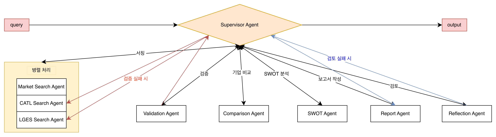

# 전기차 캐즘 여파 속 LGES·CATL 포트폴리오 다각화 전략 비교 보고서 자동 생성 에이전트

LangGraph 기반 Multi-Agent 시스템으로 LGES(LG에너지솔루션)와 CATL의 배터리 전략을 자동으로 조사·비교·분석하여 PDF 보고서를 생성합니다.

## Overview

- **Objective** : 전기차 캐즘 국면에서 양사의 포트폴리오 다각화 전략 차이를 체계적으로 비교 분석하고, 근거 기반 전략 보고서를 자동 생성
- **Method** : RAG(내부 문서 우선) + Tavily 웹서치 Fallback으로 데이터를 수집하고, Supervisor 패턴의 Multi-Agent 파이프라인이 검증·비교·보고서 작성·품질 점검을 순차 수행
- **Tools** : LangGraph, FAISS, GPT-4o-mini, Tavily Search, WeasyPrint

## Features

- **PDF·Markdown 문서 기반 정보 추출** : LGES·CATL 공시 자료 및 시장 리포트를 청크 단위로 임베딩해 FAISS 벡터 인덱스로 관리
- **RAG 우선 + 웹서치 Fallback** : 내부 문서 충분 시 RAG만 사용, 부족 시 Tavily 웹서치로 보완해 불필요한 API 비용 최소화
- **8개 노드 순차 파이프라인** : Research → Validation → Comparison → SWOT → Report → Reflection 단계로 역할 분리
- **Validation 재시도 루프** : 편향성·필수 항목 누락·출처 문제 탐지 시 Research 단계부터 최대 2회 재실행
- **Reflection 품질 점검 루프** : 필수 섹션 존재·각주 표기·LGES/CATL 서술 균형을 자동 점검하고 미달 시 보고서 재생성
- **확증 편향 방지 전략** : Validation Agent가 긍정·부정 비율을 LLM으로 분류해 한쪽 비율이 80% 초과 시 REVISE 판정, 양사 균형 서술 강제
- **보고서 자동 출력** : Markdown 및 PDF 형식으로 `output/report/`에 타임스탬프 파일명으로 저장

## Tech Stack

| Category   | Details                             |
|------------|-------------------------------------|
| Framework  | LangGraph, LangChain, Python 3.11   |
| LLM        | GPT-4o-mini via OpenAI API          |
| Retrieval  | FAISS                               |
| Embedding  | BAAI/bge-m3 (multilingual)          |
| Web Search | Tavily Search API                   |
| Export     | WeasyPrint (PDF), Markdown          |

## Agents

| # | Agent | 역할 | 사용 도구 | 입력 | 출력 |
|---|-------|------|-----------|------|------|
| A1 | Supervisor Agent | Goal/Criteria 관리, Task 분배, Validation 결과에 따른 재실행/종료 판단 | — (오케스트레이션) | 전체 State | 다음 실행 Agent 지시 |
| A2 | Market Research Agent | 시장 배경 조사 (EV 캐즘, ESS, 정책, 공급망) | RAG Retriever, Web Search | Goal + T1 정의 | `market_background` |
| A3 | LGES Search Agent | LGES 다각화 전략, 경쟁력, 리스크 분석 | RAG Retriever, Web Search | `market_background` + T2 정의 | `lges_strategy` |
| A4 | CATL Search Agent | CATL 다각화 전략, 경쟁력, 리스크 분석 | RAG Retriever, Web Search | `market_background` + T3 정의 | `catl_strategy` |
| A5 | Validation Agent | 편향/누락/형식 오류/근거 부족 검토, PASS/REVISE 반환 | — (검증) | 전체 State | `validation_result` (PASS/REVISE + 사유) |
| A6 | Comparison Agent | 6축 공통 비교 프레임 정렬, 핵심 차이 도출 | — (분석/정리) | `lges_strategy` + `catl_strategy` | `comparison_result` |
| A7 | SWOT Agent | 공통 비교 프레임 정렬, SWOT 작성, 핵심 차이 도출 | — (분석/정리) | `lges_strategy` + `catl_strategy` | `comparison_result`, `swot_result` |
| A8 | Report Agent | 최종 보고서 작성 (SUMMARY, 본문, REFERENCE 형식 맞춤) | — (생성) | 전체 State (PASS 이후) | `final_report` (Markdown) |
| A9 | Reflection Agent | 편향/누락/형식 오류/근거 부족 검토, PASS/REVISE 반환 | — (검증) | 전체 State | `validation_result` (PASS/REVISE + 사유) |

## Architecture

<p align="center">
  
</p>

## Directory Structure

```
├── data/
│   └── raw/
│       ├── catl/          # CATL 청크 문서 (.md)
│       ├── lges/          # LGES 재무 보고서 (.pdf)
│       ├── market/        # 배터리 시장 리포트 (.pdf)
│       └── common/        # 공통 참고 문서
├── faiss_index/           # FAISS 벡터 인덱스 (자동 생성)
├── src/
│   ├── agents/            # Agent 모듈 (8개 노드)
│   ├── core/              # RAG, State, Tools, 정책 유틸
│   ├── graph/             # LangGraph 워크플로우 빌더
│   └── main.py            # 실행 스크립트
├── output/
│   └── report/            # 생성된 보고서 (.md / .pdf)
├── pyproject.toml
└── README.md
```

## Getting Started

```bash
# 의존성 설치
uv sync

# 환경변수 설정
cp .env.example .env
# .env 에 OPENAI_API_KEY, TAVILY_API_KEY 입력

# 실행
.venv/bin/python -m src.main
```

보고서는 `output/report/battery_strategy_report_YYYYMMDD_HHMMSS.pdf` 로 저장됩니다.

## Contributors

- **한준교** : Graph State(`TypedDict`) 정의, Supervisor Agent 로직 구현, 전체 Graph 뼈대(Node 등록 및 기본 Edge, Conditional Edge 라우팅) 구축
- **서지윤** : Market Research Agent, Validation Agent 상세 구현 및 Supervisor와의 Reflect(재실행) 루프 연동 로직 완성
- **김준서** : LGES & CATL Strategy Agent(Fan-out/Fan-in 병렬 처리 적용), Comparison & SWOT Agent, Report Writer Agent 상세 구현
